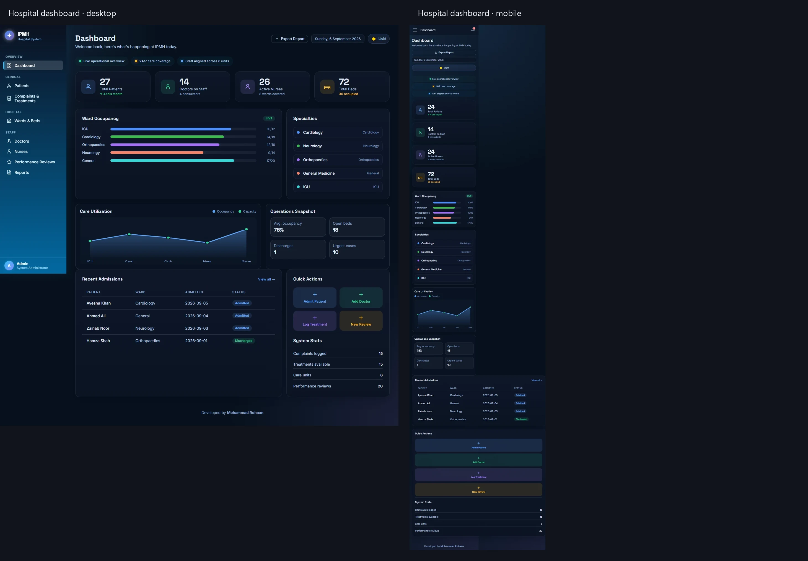

# Ivor Paine Memorial Hospital (IPMH) Management System

## Project screenshots

The dashboard preview below presents the hospital operations workspace on desktop and mobile: KPI cards, ward occupancy, specialties, care utilization, recent admissions, and quick actions are all visible in the responsive composition.



Individual captures: [desktop](docs/screenshots/desktop.webp) · [mobile](docs/screenshots/mobile.webp)

A premium, recruiter-friendly hospital management dashboard designed to present a realistic healthcare operations workflow with modern UI styling, responsive layout, and database-backed structure.

## Live Demo

- Live app: https://hospitalms-0899b.containers.snapdeploy.app
- GitHub repository: https://github.com/rohaan2802/Hospital-MS

## Project Overview

This project was built as a professional hospital administration dashboard with a strong focus on presentation quality, usability, and operational realism. It simulates a multi-department hospital system covering patient administration, doctor and nurse staffing, ward occupancy, complaints and treatment workflows, reviews, and reporting.

The application is designed to feel polished enough for a recruiter demo while still being logically grounded in a relational hospital data model.

## What Has Been Implemented

### Premium dashboard experience
- executive KPI cards for total patients, doctors, nurses, beds, occupancy, and care coverage
- operations summary strip for quick status cues
- modern analytics panel with ward utilization and activity visualization
- premium card styling, gradients, and soft glass-like UI treatment
- dark-first design with contrast-rich colors for portfolio presentation

### Clinical and administrative modules
- patient management dashboard with filters and record details
- doctor and nurse listings with role mapping
- ward and bed occupancy tracking
- complaints and treatment workflows
- performance review panel
- reports page for required queries and summaries

### Responsive and presentation-ready UX
- optimized layout for mobile, tablet, laptop, and desktop screens
- sidebar transitions and mobile-friendly top bar
- flexible grid layouts for varying device widths
- tables wrapped in scrollable containers to avoid overflow on small screens
- refined spacing and typography to improve readability across devices

### Theme system and interface polish
- dark theme as the default premium presentation mode
- light mode toggle that switches the interface to a clean, bright clinical palette
- no dark-heavy surfaces remain in light mode; the UI becomes consistently light with soft contrast
- improved hover states, badge styling, modal contrast, and action buttons

## Technology Stack

- Frontend: HTML, CSS, JavaScript
- Backend: PHP
- Database: MySQL
- Styling: custom CSS design system with responsive layout rules
- Deployment-ready: Docker / PHP host / SnapDeploy compatible

## Folder Structure

```text
Hospital-MS/
├── api/
│   ├── dashboard.php
│   ├── patients.php
│   ├── doctors.php
│   ├── nurses.php
│   ├── wards.php
│   ├── complaints.php
│   ├── reviews.php
│   ├── reports.php
│   └── helpers.php
├── config/
│   └── db.php
├── css/
│   ├── global.css
│   ├── dashboard.css
│   └── pages.css
├── js/
│   ├── api.js
│   ├── nav.js
│   ├── dashboard.js
│   ├── patients.js
│   ├── doctors.js
│   ├── nurses.js
│   ├── wards.js
│   ├── complaints.js
│   ├── reviews.js
│   ├── reports.js
│   └── data.js
├── sql/
│   ├── mysql_schema.sql
│   ├── seed_data.sql
│   └── reports_queries.sql
├── docs/
│   ├── ENTITY_MAPPING.md
│   └── TABLE_DESCRIPTIONS.md
├── .env.example
├── Dockerfile
├── index.html
├── patients.html
├── doctors.html
├── nurses.html
├── wards.html
├── complaints.html
├── reviews.html
├── reports.html
├── README.md
├── .gitignore
└── .vscode/
    ├── launch.json
    └── run-app.ps1
```

## Main Pages

- Dashboard: hospital KPIs, occupancy overview, summary cards, analytics
- Patients: patient records, admissions, ward and bed tracking
- Doctors: doctor records and consultant mapping
- Nurses: staffing and unit-based nursing coverage
- Wards & Beds: bed utilization and ward performance
- Complaints & Treatments: clinical issue and care tracking
- Reviews: performance review monitoring
- Reports: query-based reporting and database insights

## Data Model Highlights

The system is based on a realistic hospital entity structure:

- staff
- doctor
- nurse
- patient
- ward
- bed
- care_unit
- specialty
- complaint
- treatment
- performance_review
- consultant

This structure supports relational integrity, multi-department coordination, and operational workflows expected in a real hospital information system.

## Light Theme Behavior

The UI includes a theme toggle that switches between two visual modes:

- Dark mode: premium, modern, and high-contrast dashboard presentation
- Light mode: clean healthcare-friendly palette with bright surfaces, soft shadows, and airy spacing

When the light theme is activated, the interface avoids dark backgrounds and uses lighter cards, pale gradients, and readable contrast for a clean presentation experience.

## Responsive Design Notes

The dashboard is optimized for:

- mobile phones
- tablets
- laptops
- widescreen desktops

Specific design decisions include:
- flexible grid layouts
- collapsible sidebar on smaller screens
- stacked action buttons on narrow widths
- horizontally scrollable tables for data-heavy pages
- readable typography and controlled spacing in compact layouts

## Local Setup

### 1. Prepare the database

Create a MySQL database and import the schema from `sql/mysql_schema.sql`.

### 2. Configure environment values

Update `config/db.php` or your environment variables according to your local database configuration.

### 3. Run the application

From the project root, start a PHP server:

```bash
php -S localhost:8000
```

Then open:

```text
http://localhost:8000/index.html
```

## Deployment Notes

This project is deployable in a PHP-compatible hosting environment and is designed to work cleanly in a standard demo deployment setup. It is suitable for a portfolio project or academic submission because it balances backend logic with a polished frontend presentation.

## Reports and Query Coverage

The project includes analytical reporting for hospital operations, including:

- consultant and specialty mapping
- ward occupancy summary
- patient complaint and treatment tracking
- doctor review indicators
- patient-specific historical summary views
- treatment and care lookups by date range
- staffing distribution

These features are surfaced via the `reports.html` page and backend reporting modules.

## Why This Project Stands Out

This project focuses on a realistic hospital work environment while keeping the interface elegant and recruiter-friendly. It combines operational utility with premium visual design, making it appropriate for:

- academic database project submission
- healthcare management dashboard demo
- portfolio showcase for frontend and backend integration
- presentation to recruiters and evaluators

## Contributors

- Mohammad Rohaan

## License

This project is intended for educational, portfolio, and demonstration purposes.

## Final Notes

The system is intentionally built to be practical, responsive, and visually presentable without overcomplicating the implementation. It remains lightweight enough for local testing while still feeling like a polished healthcare management application.

---

This repository reflects the final stage of the hospital dashboard enhancement work, including dark-mode premium presentation, responsive layouts, patient and operations modules, analytics panels, and polished light-mode usability.
